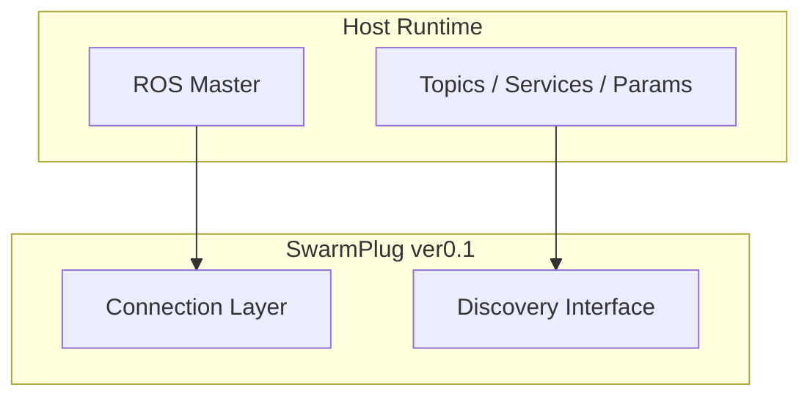

# SwarmPlug ver0.1

**Host Connection Infrastructure**

---

> 🚩 This repository is a **public demo  for **SwarmPlug ver0.1**.  
> It demonstrates core capabilities and interfaces, **without exposing the commercial core implementation**.

## Statement

SwarmPlug ver0.1 establishes a deterministic connection layer  
between SwarmPlug and a ROS host system.

It does not normalize.  
It does not snapshot.  
It does not coordinate.

It connects.

---

## Problem

Before semantic abstraction or coordination can occur, a reliable host attachment layer must exist.

ROS systems expose runtime via:

- ROS Master (XMLRPC)
    
- Topics
    
- Services
    
- Parameters
    

A sidecar infrastructure must connect and discover these interfaces consistently.

---

## Position

SwarmPlug ver0.1 defines the host attachment boundary.

`ROS Runtime  →  SwarmPlug Attachment`

ver0.1 completes the connection and discovery layer.

---

## Architecture (Conceptual)

---

## Determinism

Given a reachable ROS master,  
ver0.1 deterministically discovers:

- Topics
    
- Nodes
    
- Services
    
- Parameters
    

No transformation is applied.

---

## Scope Limitation

SwarmPlug ver0.1 does not include:

- Canonical naming
    
- Semantic abstraction
    
- Snapshot generation
    
- Communication transport
    
- Coordination logic
    

---

## Version Context

|Version|Responsibility|
|---|---|
|0.1|Host connection|
|0.2|Canonical naming|
|0.3|Semantic snapshot|

---

## Principle

Attachment precedes abstraction.  
Discovery precedes normalization.

ver0.1 establishes the attachment layer.

## Contact

If you are evaluating SwarmPlug for research or engineering use,feel free to reach out at: 

📧 **swarmplug@gmail.com**
