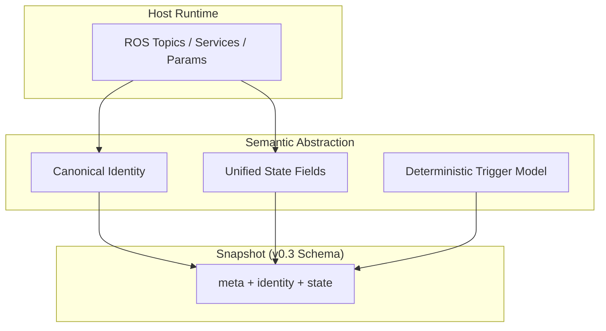

# SwarmPlug ver0.3

**Semantic Snapshot Specification**

---

## Statement

SwarmPlug ver0.3 defines a deterministic semantic snapshot specification  
for heterogeneous ROS-based systems.

It does not coordinate.  
It does not transmit.  
It does not decide.

**It standardizes semantics.**

---

## Problem

Robotic systems expose runtime state in inconsistent forms:

- Different topic names
- Different coordinate conventions
- Different mode representations
- Different task encodings
    

Without semantic normalization, higher-level coordination becomes system-specific.

---

## Position

SwarmPlug ver0.3 defines a neutral semantic abstraction boundary  
between ROS runtime and distributed coordination.

`Host Runtime  →  Semantic Abstraction  →  Snapshot`

ver0.3 completes the semantic abstraction layer.

---

## Architecture (Conceptual)

---

## Determinism

Snapshot generation follows two defined triggers:

- Event-based
    
- Periodic
    

Given identical host state and identical trigger conditions,
the resulting snapshot structure remains invariant.

---

## Schema Boundary

ver0.3 formalizes:

- `meta`    
- `identity`    
- `state`
    

Canonical state fields include:

- pose    
- twist    
- mode
    
- task_state (optional)
    

The schema is versioned.

---

## Scope Limitation

SwarmPlug ver0.3 does not include:

- Network transport    
- Mesh communication    
- Blockchain anchoring    
- Decision logic    
- Control loops
    

Those layers are out of scope.

---

## Version Context
| Version | Responsibility        |
|---------|----------------------|
| ver0.1  | Host attachment      |
| ver0.2  | Canonical identity   |
| ver0.3  | Semantic snapshot    |

---

## Principle

Infrastructure precedes coordination.  
Normalization precedes intelligence.  
Determinism precedes distribution.

ver0.3 establishes the normalization layer.

## License

This version specification is part of the SwarmPlug documentation.

Licensed under the **SwarmPlug Documentation License v1.0**.

See the root LICENSE file for details.

