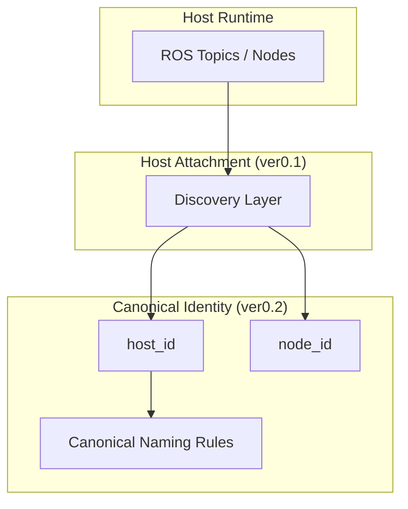

# SwarmPlug ver0.2

**Canonical Naming Infrastructure**

---

## Statement

SwarmPlug ver0.2 introduces a canonical identity and naming layer  
above host attachment.

It does not snapshot.  
It does not transmit.  
It does not coordinate.

It standardizes identity.

---

## Problem

ROS systems use inconsistent naming across:

- Devices
    
- Networks
    
- Deployments
    

Without canonical identity,  
cross-system semantic alignment becomes ambiguous.

---

## Position

SwarmPlug ver0.2 defines a stable identity anchor  
independent of host runtime naming.

`ROS Runtime → Host Attachment → Canonical Identity`

ver0.2 completes the identity normalization layer.

---

## Architecture (Conceptual)

---

## Determinism

Given identical host configuration,  
ver0.2 produces identical canonical identity anchors.

Identity is stable across:

- Reboots
    
- Network changes
    
- Deployment contexts
    

---

## Scope Limitation

SwarmPlug ver0.2 does not include:

- State abstraction
    
- Snapshot schema
    
- Communication layers
    
- Blockchain anchoring
    
- Decision mechanisms
    

---

## Version Context

|Version|Responsibility|
|---|---|
|0.1|Host connection|
|0.2|Canonical naming|
|0.3|Semantic snapshot|

---

## Principle

Identity precedes semantics.  
Normalization precedes distribution.

ver0.2 establishes the identity layer.

## Contact

If you are evaluating SwarmPlug for research or engineering use,feel free to reach out at: 

📧 **swarmplug@gmail.com**
