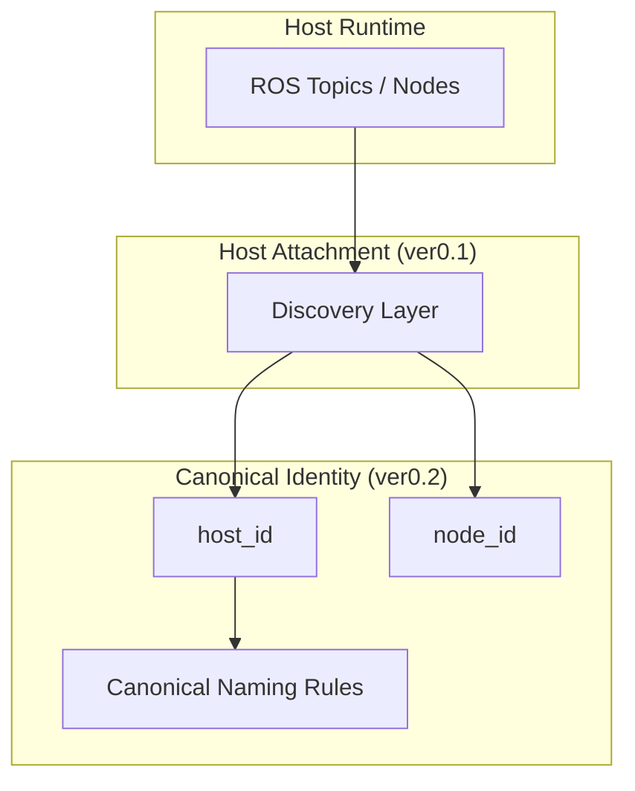

# SwarmPlug ver0.2

**Canonical Identity Specification**

---

## Statement

SwarmPlug ver0.2 defines a canonical identity specification layer  
above host attachment.

It does not snapshot.  
It does not transmit.  
It does not coordinate.

**It standardizes identity.**

---

## Problem

ROS deployments often exhibit inconsistent naming patterns across:

- Devices
- Networks    
- Deployments
    

Without canonical identity,  
cross-system semantic alignment becomes ambiguous.

---

## Position

SwarmPlug ver0.2 defines a stable identity anchor  
independent of host runtime naming.

`ROS Runtime → Host Attachment → Canonical Identity`

ver0.2 completes the identity normalization layer.

---

## Architecture (Conceptual)

---

## Determinism

Given identical host configuration,  
ver0.2 produces identical canonical identity anchors.

Identity remains invariant across:

- System reboots
- Network reconfiguration
- Deployment relocation

---

## Scope Limitation

SwarmPlug ver0.2 does not include:

- State abstraction    
- Snapshot schema   
- Communication layers    
- Blockchain anchoring    
- Decision mechanisms

ver0.2 does not modify host runtime behavior.

---

## Version Context

| Version | Responsibility        |
|---------|----------------------|
| ver0.1  | Host attachment      |
| ver0.2  | Canonical identity   |
| ver0.3  | Semantic snapshot    |

---

## Principle

Identity precedes semantics.  
Normalization precedes distribution.

ver0.2 establishes the identity layer.

---
## License

This version specification is part of the SwarmPlug documentation.

Licensed under the **SwarmPlug Documentation License v1.0.**

See the root LICENSE file for details.

