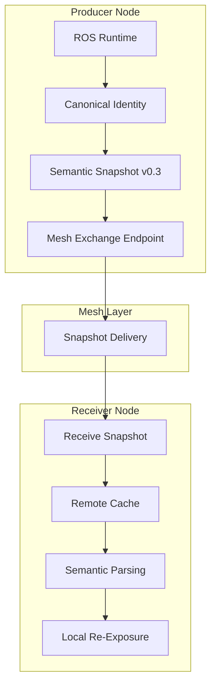

# SwarmPlug ver0.4

**Mesh Semantic Snapshot Exchange and Re-Exposure Specification**

---

## Statement

SwarmPlug ver0.4 defines a deterministic mesh-based semantic snapshot exchange  
and controlled re-exposure mechanism across distributed SwarmPlug nodes.

It does not anchor.  
It does not decide.  
It does not control.

**It distributes semantic state and re-exposes it locally.**

---

## Problem

Once semantic snapshots have been generated (ver0.3),  
they must be made observable across multiple nodes.

However, direct cross-node integration of host runtime (e.g., ROS topics) leads to:

- Tight coupling between distributed runtimes
- Uncontrolled propagation behavior
- Recursive forwarding and message amplification
- Loss of deterministic boundaries

A dedicated infrastructure layer is required to:

- exchange semantic state across nodes
- preserve system boundaries
- enable distributed observability without runtime entanglement

---

## Position

SwarmPlug ver0.4 defines the exchange layer above semantic snapshot generation.

`Host Runtime → Host Attachment → Canonical Identity → Semantic Snapshot → Mesh Exchange → Local Re-Exposure`

**ver0.4 completes the distributed semantic exchange layer.**

It explicitly separates:

- local runtime (host)
- semantic state (snapshot)
- distributed exchange (mesh)
- local re-exposure (receiver-side reconstruction)

---

## Architecture (Conceptual)

```mermaid
 flowchart TB

  subgraph "Producer Node"
    A1["ROS Runtime"]
    A2["Canonical Identity"]
    A3["Semantic Snapshot v0.3"]
    A4["Mesh Exchange Endpoint"]
  end

  subgraph "Mesh Layer"
    B1["Snapshot Delivery"]
  end

  subgraph "Receiver Node"
    C1["Receive Snapshot"]
    C2["Remote Cache"]
    C3["Semantic Parsing"]
    C4["Local Re-Exposure"]
  end

  A1 --> A2 --> A3 --> A4
  A4 --> B1 --> C1 --> C2 --> C3 --> C4


```

## Determinism

Given:

- identical snapshot content
    
- identical sender identity
    
- identical exchange topology
    
- identical trigger conditions
    

ver0.4 produces deterministic cross-node state distribution.

Received snapshots:

- are treated as external state
    
- are not re-emitted as local-origin snapshots
    
- do not trigger recursive exchange
    

This guarantees stability under concurrent multi-node transmission  
and prevents message storm amplification.

---

## Exchange Boundary

ver0.4 defines:

- snapshot as the only exchange object
    
- node-to-node delivery semantics
    
- producer / receiver role separation
    
- single and multi-producer transmission patterns
    
- single and multi-receiver dissemination patterns
    
- full-mesh concurrent exchange behavior
    
- strict separation between local-origin and received state
    

**Raw host runtime streams are never exchanged.**

---

## Re-Exposure Principle

SwarmPlug ver0.4 does not construct a distributed system  
by directly connecting host runtimes.

It enforces a two-step mechanism:

1. **Normalization (ver0.3)**  
    Host runtime → deterministic semantic snapshot
    
2. **Re-Exposure (ver0.4)**  
    Received snapshot → local ROS-visible interface
    

Therefore:

- no direct subscription to remote ROS-native topics
    
- no transparent runtime mirroring across nodes
    
- no leakage of host-level internal structure
    

Instead:

- semantic state is transmitted
    
- selected fields are parsed
    
- local ROS topics / parameters are rewritten
    

**Distributed observability is achieved through semantic rewriting,  
not runtime coupling.**

---

## Scope Limitation

SwarmPlug ver0.4 does not include:

- Blockchain anchoring
    
- Reliable delivery guarantees (ACK / retry)
    
- Global coordination or scheduling
    
- Task allocation or decision-making
    
- Control loops
    
- Direct remote ROS topic subscription
    
- Full runtime federation
    
- Semantic transformation beyond snapshot definition
    

**ver0.4 does not convert exchange into coordination.**  
**ver0.4 does not convert re-exposure into control.**

---

## Version Context

|Version|Responsibility|
|---|---|
|ver0.1|Host attachment|
|ver0.2|Canonical identity|
|ver0.3|Semantic snapshot|
|ver0.4|Mesh exchange and local re-exposure|

---

## Principle

Normalization precedes exchange.  
Exchange precedes re-exposure.  
Re-exposure preserves local boundaries.

Transport follows semantics.  
Distribution follows determinism.  
Visibility follows controlled rewriting.

**ver0.4 establishes distributed observability  
without runtime entanglement.**

---

## License

This version specification is part of the SwarmPlug documentation.

Licensed under the **SwarmPlug Documentation License v1.0**.

See the **main LICENSE** file for details.

