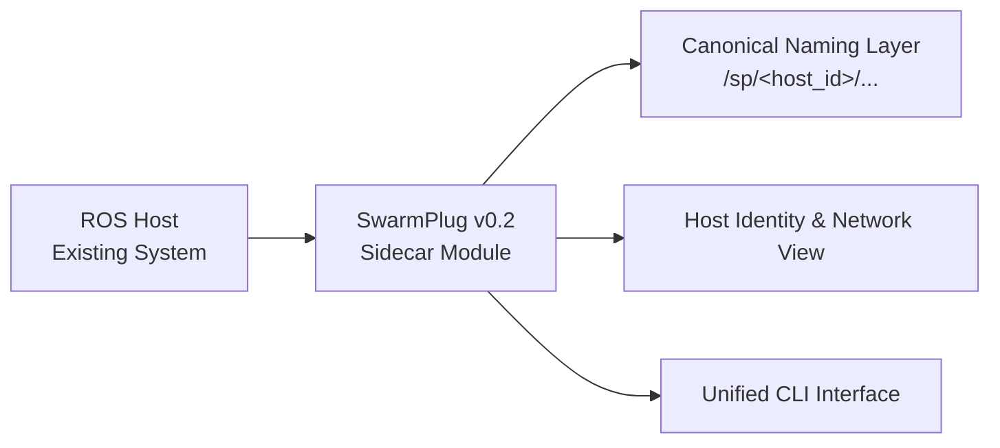

## High-level architecture (ver0.2)

### ROS Host (Left)

- Any **existing** ROS system
    
- No need to install SwarmPlug
    
- No configuration changes required
    
- Runs completely unchanged
    
---
### SwarmPlug v0.2 (Center)

- A **sidecar module**
    
- Attaches to ROS in a **read-only** manner
    
- Injects no nodes, participates in no scheduling, and makes no decisions
    
---
### Canonical Naming Layer

- Assigns a **stable, attributable name** to every ROS resource
    
- Answers the core question:
    
    > “Who does this topic / service / action belong to?”
    
---
### Host Identity & Network View

- Explicitly defines:
    
    - Which **host** this plugin represents
        
    - What its **preferred network identity** is
        
- Lays the foundation for future mesh, appliance, and multi-NIC deployments
    
---
### Unified CLI Interface

- The single interface between humans and the system
    
- Unified, scriptable, and automation-friendly
    
- Does not expose internal complexity
